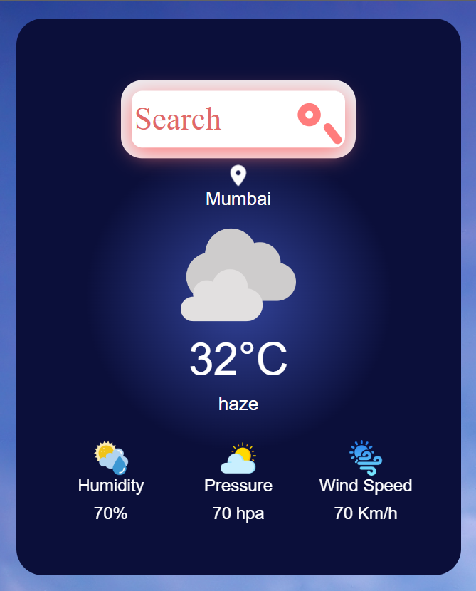

# WeatherApp

Welcome to the Weather App⛅! This application provides current weather information based on user-selected locations.

## Features

- **Current Weather**: Display current weather conditions including temperature, humidity, pressure and wind speed.
- **Location Search**: Allow users to search for weather information by location.
- **Responsive Design**: Ensures a great user experience across different devices.

## Technologies Used

- HTML/CSS/JavaScript
- Bootstrap
- OpenWeatherMap API

## Screenshots

  
  
  

## Installation

To run the Weather App locally:

1. Clone this repository: `git clone https:/bhagyashri-borse-1802/github.com//weather-app.git`
2. Navigate to the project directory.
3. Run `nodemon solution.js` in your terminal.

## Usage

- Enter a city name to get current weather information.
- Explore the information about temperature, humidity, pressure and wind speed.
- Enjoy using the Weather App!
  
See Live App ->
https://weatherapp-ehty.onrender.com
